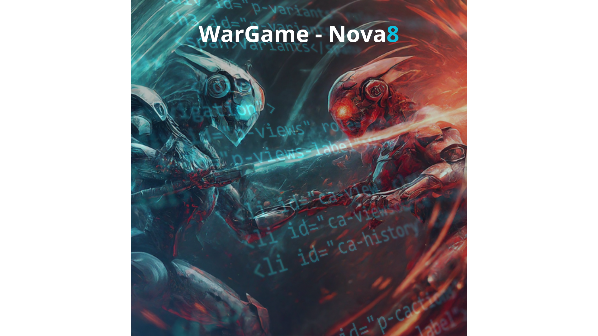

# WarGame - Nova8

<div align="center">
  
</div>


## Introdução WarGame

Este repositório introduz o WarGame, no qual é um WebGoat em JavaScript, sendo desenvolvido pela equipe de consultoria da Nova8,
com o intuito de dar um treinamento para toda Nova8, afim de aprender como resolver algumas vulnerabilidades, como SQL Injection, DOM XSS, XXE entre várias outras vulnerabilidades.

---
## Sumário   
- [Introdução WarGame](#introdução-wargame)
- [Sumário](#sumário)
- [O que é um WebGoat](#o-que-é-um-webgoat)
- [Vulnerabilidades](#vulnerabilidades)
- [Antes de começar](#antes-de-começar)
- [Instalações](#instalações)
  - [Instalação Git](#instalação-git)
  - [Instalação MySQL](#instalação-mysql)
  - [Instalação do Node](#instalação-do-node)
- [Clonando o projeto](#clonando-o-projeto)
- [Instalação das bibliotecas do lado do servidor](#instalação-das-bibliotecas-do-lado-do-servidor)
- [Configurando a conexão com o Banco de Dados](#configurando-a-conexão-com-o-banco-de-dados)
- [Começando O WarGame](#começando-o-wargame)

---

## O que é um WebGoat

Com base no site da OWASP: 

"WebGoat é um aplicativo deliberadamente inseguro que permite que desenvolvedores interessados como você testem vulnerabilidades comumente encontrado em aplicativos baseados em Java que usam componentes de código aberto comuns e populares."

[Clique aqui para entender melhor sobre o que é um WebGoat.](https://owasp.org/www-project-webgoat/) 

---

## Vulnerabilidades

Aqui contém uma documentação, explicando sobre diferentes tipos de vulnerabilidades, como elas surgem e exemplos.

[Clique aqui para ir até a documentação](./wargame_nova8.pdf) 

---

## Antes de começar

⚠️ **ATENÇÃO** ⚠️

Antes de começar a corrigir as vulnerabilidades, você precisa dos seguintes pré-requisitos:

- Instale o git
- Instale e configure o banco de dados MySQL
- Instale e configure o Node.js
- Instale todas as bibliotecas necessárias do lado do servidor(Back-end)
- Tenha conhecimento de programação em HTML e CSS
- Tenha conhecimento de programação em JavaScript

---

# Instalações

## Instalação Git

Este link vai redirecionar você ao site oficial do Git, para a instalçao do Git, no SO Windows.

[Clique aqui para ir até a instação do Git](https://git-scm.com/downloads) 

---

## Instalação MySQL

Este link vai redirecionar você ao site oficial do MySQL, para a instação do MySQL.

[Clique aqui para ir até a instação do MySQL](https://www.mysql.com/downloads/) 

---

## Instalação do Node

Este link vai redirecionar você a um guia de como instalar o Node.js

[Clique aqui para ir até o guia de instalação do Node.js](https://www.alura.com.br/artigos/como-instalar-node-js-windows-linux-macos) 

Este link vai redirecionar você ao site oficial do Nodejs, para a instalação do Node.js

[Clique aqui para ir até a instalação do Node.js](https://nodejs.org/en/download) 

---

## Clonando o projeto

⚠️ **ATENÇÃO** ⚠️

Lembre-se de já ter instalado e configurado o Node.

Para clonar o projeto, basta iniciar o git bash em uma pasta na qual deseja subir o projeto e colocar os seguintes comandos:

```bash
git init
```

E depois coloque o comando:

```bash
git clone https://github.com/GustavoPrevelate/WebGoat-Gustavo.git
```

Após isso, suba o projeto no Visual Studio Code(VS Code).

---

## Instalação das bibliotecas do lado do servidor

Aqui contêm a lista de todos os comandos que é preciso colocar para instalar as bibliotecas necessárias
do lado do servidor, na seguinte ordem:

1. Express:

```bash
npm install express
```

---

2. Body-parser:

```bash
npm install body-parser
```

---

3. MySQL:

```bash
npm install mysql
```

---

4. Dotenv:

```bash
npm install dotenv
```

---

5. Cors:

```bash
npm install cors
```

---

6. Child Process (incluído no Node.js padrão, não requer instalação separada).

---

7. Libxmljs:

```bash
npm install libxmljs
```

---

8. HTTP (incluído no Node.js padrão, não requer instalação separada).

---

9. FS (File System) (incluído no Node.js padrão, não requer instalação separada).

---

10. Multer:

```bash
npm install multer
```

---

## Configurando a conexão com o Banco de Dados

Dentro da pasta "wargame_backend", nos arquivos ".env" e "app.js" têm uma configuração padrão para uma conexão com um Banco de Dados MySQL, é preciso que você mude o "DB_PASSWORD" presentes nesses dois arquivos, para a senha que você estabeleceu no seu Banco de Dados e configurar a conexão conforme a instância que você criou no "MySQL Connections" dentro do seu Banco de Dados MySQL.

---

## Começando O WarGame

Após ter concluído a instalação dos recursos necessários, é preciso iniciar o terminal, com o comando " Ctrl + ' ". ou simplismente clicando em "Terminal" e "New Terminal" e ir até a o arquivo "app.js" que está dentro da pasta "wargame_backend".

Ao chegar nesse arquivo, é preciso colocar o seguinte comando para subir o servidor:

```bash
node .\app.js
```

Após esse comando, o servidor estará funcionando normalmente, e você já pode iniciar o arquivo index.html para subir a aplicação Web.

---
